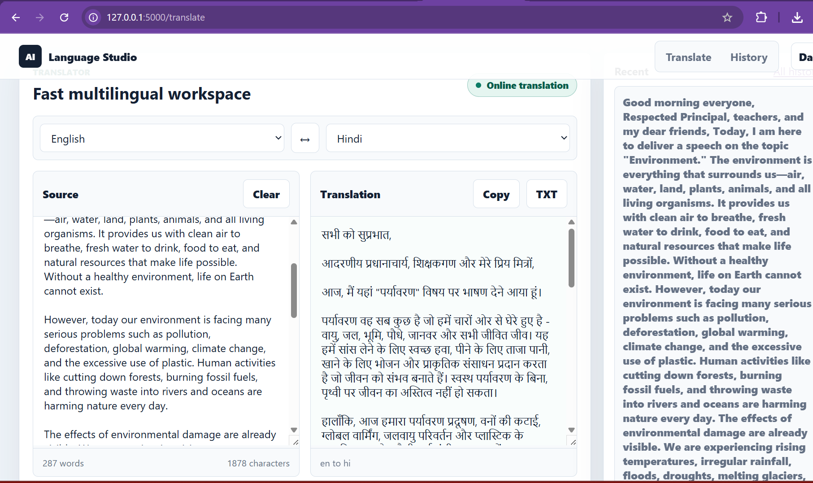
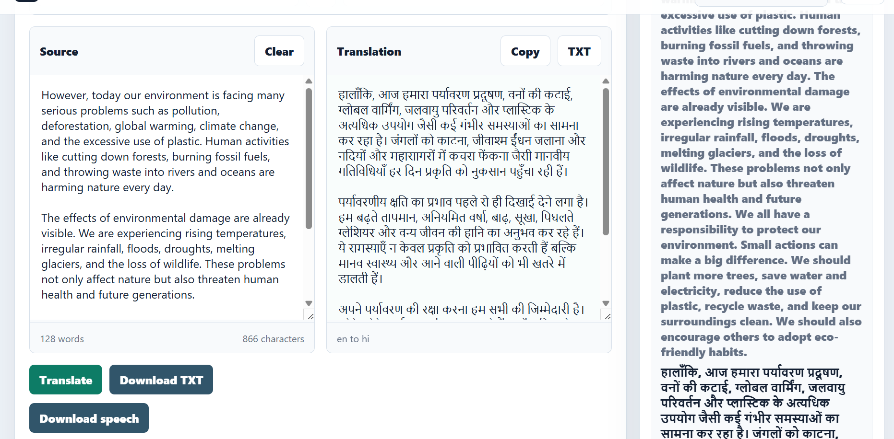

# AI Language Translation Studio


AI Language Translation Studio is a clean Flask-based translation web app for translating text between languages, managing translation history, downloading translated output, and generating speech audio. It is designed as a simple but polished multilingual workspace where users can write or paste text, translate it quickly, and reuse the result through copy, TXT download, and speech download options.

## Live Preview

### Translation Workspace

<p align="center">
  
</p>

### English to Hindi Translation Result

<p align="center">
  
</p>

## Why This Project Stands Out

- Fast and focused translation workspace built with Flask.
- Clean two-panel editor for source text and translated output.
- Language selector for source and target languages.
- English to Hindi translation support with readable Devanagari output.
- Translation history panel for reviewing previous work.
- Copy translated text directly from the app.
- Download translated text as a `.txt` file.
- Generate downloadable speech audio from translated text.
- REST API endpoints for translation and supported languages.
- SQLite database support for persistent translation history.
- Responsive layout with a simple, modern UI.

## Features

| Feature | Description |
| --- | --- |
| Text Translation | Translate text between supported languages using a simple web interface. |
| Source and Target Language Selection | Choose the input language and the language you want to translate into. |
| Recent History | Save and view recent translations for quick access. |
| Copy Output | Copy translated text instantly from the result panel. |
| TXT Export | Download translated content as a text file. |
| Speech Download | Convert translated text into speech and download the audio. |
| API Support | Use translation features programmatically through API routes. |
| SQLite Storage | Store translation history locally in a lightweight database. |

## Tech Stack

| Layer | Technology |
| --- | --- |
| Backend | Python, Flask |
| Translation | Deep Translator |
| Text to Speech | gTTS |
| Database | SQLite, SQLAlchemy |
| Frontend | HTML, CSS, JavaScript |
| Testing | Python unittest |

## Project Structure

```text
AI-Language-Translation-Studio/
|-- app.py
|-- run.py
|-- config.py
|-- requirements.txt
|-- database/
|   |-- database.py
|   |-- models.py
|-- routes/
|   |-- api.py
|   |-- history.py
|   |-- home.py
|   |-- speech.py
|   |-- translate.py
|-- services/
|   |-- export_service.py
|   |-- history_service.py
|   |-- language_detector.py
|   |-- speech_service.py
|   |-- translator_service.py
|-- static/
|   |-- css/
|   |-- js/
|-- templates/
|   |-- base.html
|   |-- history.html
|   |-- index.html
|-- tests/
|   |-- test_translation_app.py
|-- docs/
|   |-- Screenshots/
```

## Getting Started

### 1. Clone the Repository

```bash
git clone https://github.com/amitpal200/AI-Language-Translation-Studio-.git
cd AI-Language-Translation-Studio-
```

### 2. Create a Virtual Environment

```bash
python -m venv venv
```

Activate it on Windows:

```powershell
venv\Scripts\activate
```

Activate it on macOS/Linux:

```bash
source venv/bin/activate
```

### 3. Install Dependencies

```bash
pip install -r requirements.txt
```

### 4. Run the Application

```bash
python run.py
```

Open the app in your browser:

```text
http://127.0.0.1:5000
```

## API Usage

### Translate Text

```powershell
Invoke-RestMethod -Method Post -Uri http://127.0.0.1:5000/api/translate -ContentType "application/json" -Body '{"text":"hello","target_language":"hi"}'
```

Example response:

```json
{
  "translation": "नमस्ते",
  "target_language": "hi",
  "history_id": 1
}
```

### List Supported Languages

```powershell
Invoke-RestMethod http://127.0.0.1:5000/api/languages
```

## Testing

Run the test suite with:

```bash
python -m unittest tests.test_translation_app
```

## Important Notes

- Full translation support requires internet access because the app uses online translation services.
- Text-to-speech output also depends on online speech generation services.
- A few offline sample translations are included so the project can still be smoke-tested without network access.
- Screenshots are stored inside `docs/Screenshots` so they display correctly on GitHub.

## Author

Built by [Amit Pal](https://github.com/amitpal200).

## Repository

GitHub: [AI Language Translation Studio](https://github.com/amitpal200/AI-Language-Translation-Studio-)
